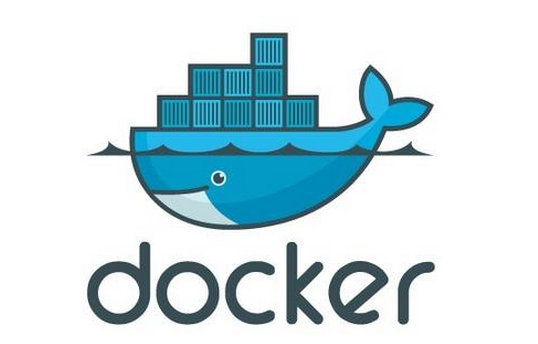
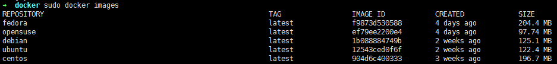
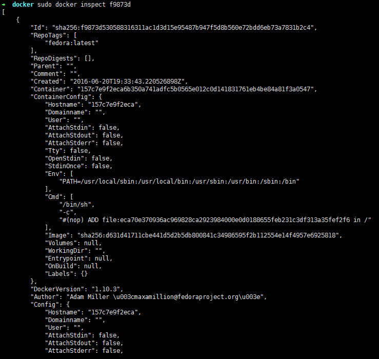
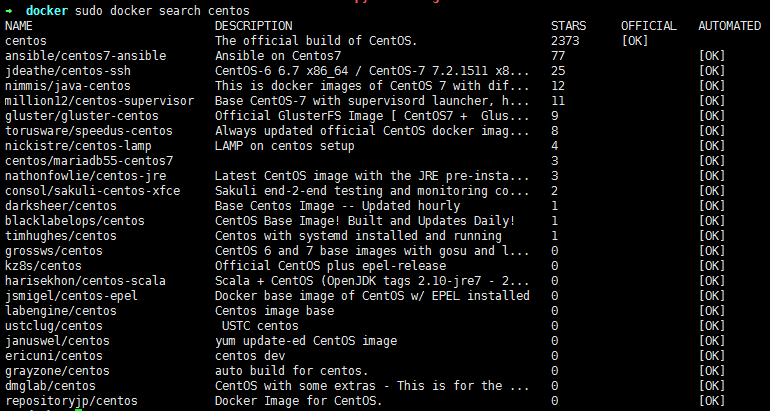

# learn-docker



[TOC]

如何在现有的硬件条件下提升最大的性能，以前或许通过购买更多硬件，提升主频，增加多核来实现。

如何在一台服务器上运行N个环境呢，或许有人说可以同时运行N个虚拟机，OK，但是还有一种方案是同时运行N个Docker容器。


# 什么是Docker

**BUILD, SHIP, RUN 一次封装，到处运行**

Docker 是一个开源的应用容器引擎，让开发者可以打包他们的应用以及依赖包到一个可移植的容器中，
然后发布到任何流行的 Linux 机器上，也可以实现虚拟化。
容器是完全使用沙箱机制，相互之间不会有任何接口。

## Docker的优势

 - 更快速的交付和部署
 - 更高效的资源利用，运行不需要额外的虚拟化管理程序，是内核级的虚拟化，可以实现更高的性能，同时对资源的要求不高
 - 更轻松的迁移和扩展，Docker容器几乎可以在任意的平台上运行
 - 更简单的更新管理，使用Dockerfile，只需要小小的修改，就可以替代以往大量的更新工作，并且所有的修改都以增量的方式进行分发和更新

## Docker的劣势

 - 资源隔离不如虚拟机
 - 版本还在更新，一些模块依赖高版本，有兼容问题

## Docker与KVM的对比


 - Docker有比虚拟机更少的抽象层
 - Docker利用的是宿主机的内核，而不需要Guest OS
 - Docker在访问内存时，不需要虚拟物理地址的转换
 - Docker启动速度在秒级，优于KVM
 - Docker可以通过git的操作来获取、更新、分发等，方便极客


# 镜像相关

## 获取镜像

```
sudo docker pull name[:tag]
```
如果不跟tag，那么会下载最新版。

例如：

```
sudo docker pull ubuntu:10.04
```
在该镜像中运行一个bash
```
sudo docker run -ti ubuntu /bin/bash
```

## 查看镜像信息

```
sudo docker images
```

结果如下图所示：




可以使用**inspect**获取更详细的镜像信息
```
sudo docker inspect <IMAGE ID>
```

出现下述JSON格式的信息：




## 搜索镜像

```
sudo docker search <name>
```




## 删除镜像

```
sudo docker rm <contain-name>  # Remove one or more contrainer
sudo docker rmi <image-name>   # Remove one or more images
```

## 创建镜像

创建镜像有3种方法：
- 基于已有镜像的容器创建
  - `sudo docker commit -m describe_info -a author image-new-id image-new-name`
- 基于本地模板导入
- 基于Dockerfile创建

## 保存为本地镜像

```
sudo docker save -o tar-file image-name
```
比如：

```
sudo docker save -o centos7-ipython.tar.gz centos-ipython
```
其中centos-ipython，是我把ipython的开发环境添加到了官方centos中。
打包的文件叫official版本大了不少，为597MB。


## 载入本地镜像

```
sudo docker load --input tar-file
or
sudo docker load < tar-file
```

## 上传镜像

如果感觉自己制作的镜像质量比较高，用的人很多，可以考虑上次到Docker hub上。
```
sudo docker push image-name[:tag]
```
